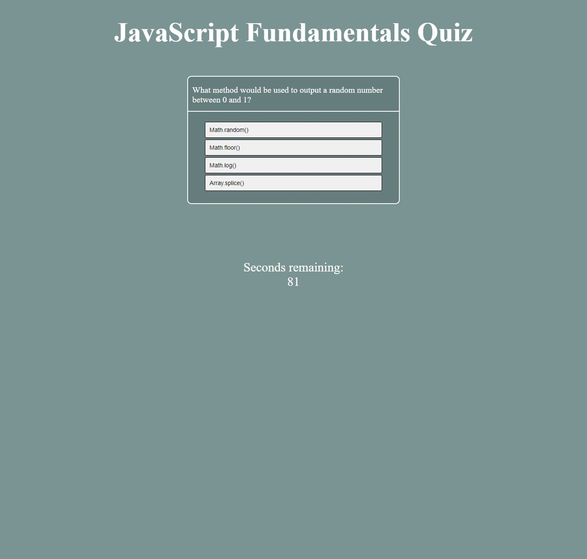

# JavaScript Fundamentals Quiz

## Description

This JavaScript fundamentals quiz is a multiple choice quiz that once completed, saves a score for how quickly the quiz was completed. The score, along with the user's intials, will be saved and shown on the leaderboard. 

The purpose of this exercise was to deploy newly aquired JavaScript techniques to write a dynamic application that goes beyond the scope of a static webpage. This page was built from scratch using HTML, CSS, and JavaScript.

This application is deployed on GitHub pages:
  https://danielschris96.github.io/multiple-choice-quiz/

## Usage

Once the page is loaded, the quiz can be started by clicking the "Start" button. The user selects an answer and is either docked 10 seconds for an incorrect answer, or moves to the next question. There are a total of 8 questions in this quiz.

Once complete, the user enters their initials and their score will be saved to local storage and the leaderboard. The user can reset the leaderboard with the "Reset scores" button.

## Credits

https://www.w3schools.com/jsref/prop_win_localstorage.asp 
https://www.w3schools.com/jsref/met_document_createelement.asp 
https://www.w3schools.com/jsref/prop_style_visibility.asp 
https://www.w3schools.com/jsref/met_document_addeventlistener.asp 
https://www.w3schools.com/jsref/met_document_queryselector.asp

## License

None
